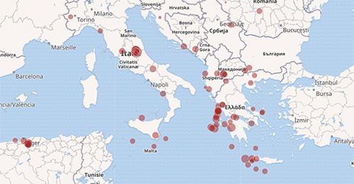

# Infovyz

_Infovyz_ is a JavaScript/d3 based visualization library.

[](https://www.npmjs.com/package/infovyz)
[](https://www.npmjs.com/package/infovyz)
[](https://www.npmjs.com/package/infovyz)

## Installation and Usage

We recommend installing the module using npm. (Look here for instructions on how to use infovyz with bower: https://github.com/weblyzard/infovyz/wiki/Bower-Usage)

```bash
npm install infovyz
```

Add the required files to your HTML file. Please note that Infovyz requires `d3.js` V4 (https://www.npmjs.com/package/d3) and `d3-tile` (https://www.npmjs.com/package/d3-tile).

```html
<link rel="stylesheet" type="text/css" href="node_modules/infovyz/build/infovyz.css">
<script src="//d3js.org/d3.v4.min.js"></script>
<script src="//d3js.org/d3-tile.v0.0.min.js"></script>
<script src="node_modules/infovyz/build/infovyz.min.js"></script>
```

To get started and initialize a geographic map attached to the `body` tag, use the following JavaScript code:

```javascript
var map = infovyz.map(d3)('body');
```

Just call `map()` again with an array of location objects to add some bubbles to the map:

```javascript
map([
  {
    id: 'Vienna, Austria',
    latitude: 48.210033,
    longitude: 16.363449
    value: 1.741
  },
  {
    id: 'Berlin, Germany',
    latitude: 52.520008,
    longitude: 13.404954
    value: 3.502
  }
]);
```

## Examples

To run the examples in your browser, clone the repository to your local machine and run the other commands:

```bash
git clone https://github.com/weblyzard/infovyz.git
cd infovyz
npm install
npm start
```

The console output should tell you at which address you can reach the static webserver, for example:

- http://localhost:8080/examples/earthquakes/
- http://localhost:8080/examples/state-capitals/



## Testing

_Infovyz_ is using tape for testing its functionality:

```bash
npm install
npm test
```

## Development

The build process uses rollup (https://github.com/rollup/rollup), so you can use ES6 modules, however the rest of the code is still ES5.

During development, using the following command allows you to watch the source files and do an automatic rebuild. Please note that minifying is not done at this stage.

```bash
npm run-script watch
```

## Documentation

See Wiki: <https://github.com/weblyzard/infovyz/wiki>